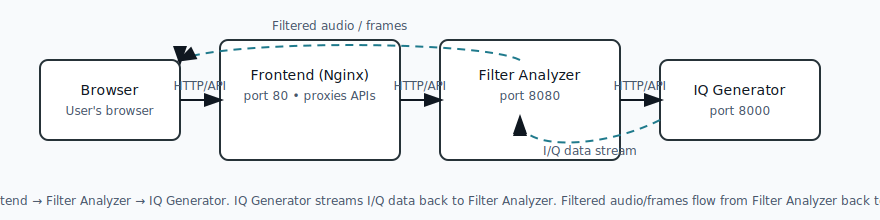

# Audio Analyzer

A small monorepo containing three services that work together to capture and analyze I/Q audio data.

## Services overview ✅

- **frontend** (`audio_filter_frontend`)
  - Nginx serves the built Angular app on port **80**.
  - On container start the container configures Nginx and the app using environment variables; Nginx proxies API requests to the backend services.

- **backend - filter analyzer** (`audio-filter-analyzer`)
  - A FastAPI service that connects to the IQ generator, performs filtering/analysis and serves API endpoints on port **8080**.

- **backend - IQ generator** (`audio-iq-generator`)
  - Service that generates I/Q data for testing/streaming and listens on port **8000**.

## Quick start (Docker) 🚀

### Prerequisites
- Docker must be installed.

### Start everything
From the repository root run:

```bash
docker compose up --build
```

This command will build all three images (frontend, backend-filter-analyzer and backend-iq-generator) and start the composition defined in `docker-compose.yml`.

To stop and remove containers/networks:

```bash
docker compose down
```

## Access via browser

Open `http://localhost` to access main application.

Open `http://localhost/generator_ctl.html` to access application to start and stop generator (not meant for end users).

## Development mode ⚙️

Each component can be built and run individually in development mode. For per-component instructions and more details see:

- `backend/README.md` (backend development & run instructions)
- `frontend/README.md` (frontend development & run instructions)

## Notes 🔧

- Port mappings in the top-level `docker-compose.yml`:
  - Frontend: host `80` -> container `80`
  - Filter analyzer: host `8080` -> container `8080`, not intended to be used directly
  - IQ generator: host `8000` -> container `8000`
  
- Both backend components are not intended to be used on ports `8080` and `8000` outside the docker composition. 

- The frontend container configures Nginx and the static app at startup (see frontend Dockerfile and entrypoint).

## Architecture diagram 🗺️

A minimal ASCII diagram describing how the services connect:
Nginx (frontend) proxies API requests to both backend services above on their respective ports.
Below is a simple diagram showing how the pieces connect (also available as an SVG at `docs/architecture.svg`):



**Note:** The IQ generator sends I/Q data to the Filter Analyzer (I/Q data stream), and the Filter Analyzer returns filtered audio/frames back to the Browser (typically delivered via the Frontend).

---

# Kubernetes Hackaton task

## Goal 🎯
- Replace the current Docker Compose based dev/run flow with a Kubernetes-based deployment suitable for the hackaton.

## Requirements / Tasks ✅

1. **Kubernetes hosting**
- Replace the top-level `docker-compose.yml` deployment with Kubernetes manifests (or a Helm chart) that define:
  - `Deployment` and `Service` for `audio-filter-analyzer`, `audio-iq-generator`, and `audio-filter-frontend`.
  - `ConfigMap` / `Secret` for runtime configuration previously injected into the frontend container.
  - `Ingress` (or `IngressRoute`) to expose the frontend and API endpoints to the outside world.

2. **Webserver / Ingress (frontend)** 🌐
- The frontend will be served from a Kubernetes workload (e.g., a `Deployment` serving the built Angular files).
- You may avoid using the current Nginx container; instead:
  - Use an **Ingress Controller** (Traefik, NGINX Ingress Controller, or similar) as the cluster web proxy, and
  - Use a minimal static webserver image (Caddy, httpd, or a slim nginx) inside the frontend `Deployment` to serve files.
- Part of the task: pick and document the webserver / ingress choice and adapt the Dockerfile/entrypoint accordingly.

3. **Per-client scaled filter-analyzer instances (session-based autoscaling)** ⚖️
- The cluster must ensure a new instance of `audio-filter-analyzer` is made available for every new client (browser tab) connection. Options to implement this:
  - **Recommended approach (session manager):**
    - Implement a small **Session Manager** service the frontend calls when a client connects.
    - The Session Manager creates or allocates a dedicated `filter-analyzer` Pod (or a Pod from a pre-warmed pool) via the Kubernetes API, and returns a per-session endpoint (service or direct Pod IP) to the frontend.
    - Ensure routing via a headless Service, dynamic endpoints, or update an Ingress/Route held by a gateway (Envoy / Traefik) to forward the session traffic to the specific Pod.
    - Add session TTL / cleanup logic to delete pods after the client disconnects or after inactivity.
  - **Alternative approach (autoscaling by metric):**
    - Export an "active sessions" metric and use HPA (with custom metrics via Prometheus Adapter) or KEDA to scale replicas to match the number of active sessions. This scales the pool size, not necessarily 1:1 per tab.
- Consider sticky routing, session affinity, and fast startup (pre-warmed pool) for UX.

## Implementation checklist ✅
- [ ] Add Kubernetes manifests or Helm chart to `k8s/` (Deployments, Services, Ingress, ConfigMap, RBAC for Session Manager)
- [ ] Add a `Session Manager` component (or document how a pool + HPA will be used)
- [ ] Add scripts or `Makefile` targets for local testing with `minikube` / `kind`
- [ ] Add documentation for chosen Ingress Controller and the frontend webserver choice
- [ ] Add load-testing guidance to validate per-session provisioning and cleanup

## Notes & Considerations 🔧
- Using the Kubernetes API to create many small Pods requires RBAC rules and careful resource quotas and limits.
- Using a pre-warmed pool reduces latency vs creating a Pod per connection synchronously.
- For rapid prototyping, Knative or serverless approaches can be explored for per-request scaling, though WebSocket/session-based cases may need special handling.

> <small style="color:#6c757d;">
> **GitHub Copilot Pro prompt:** in the section **Kubernetes Hackaton task** describe:
> 
> - Instead of using Docker Compose, the containers shall be hosted by Kubernetes.
> - The Nginx container may not be used; prefer a Kubernetes-native webserver / Ingress Controller.
> - The automatic load balancer should open a new instance of `filter-analyzer` for every new client (browser tab) connection.
> </small>